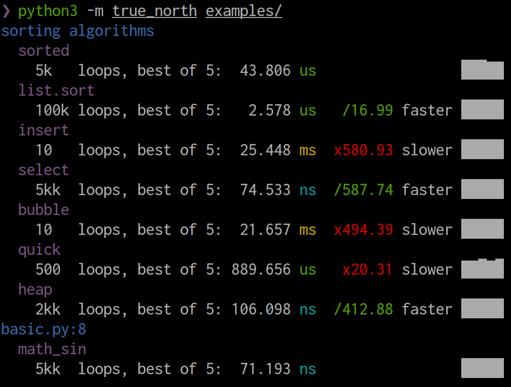
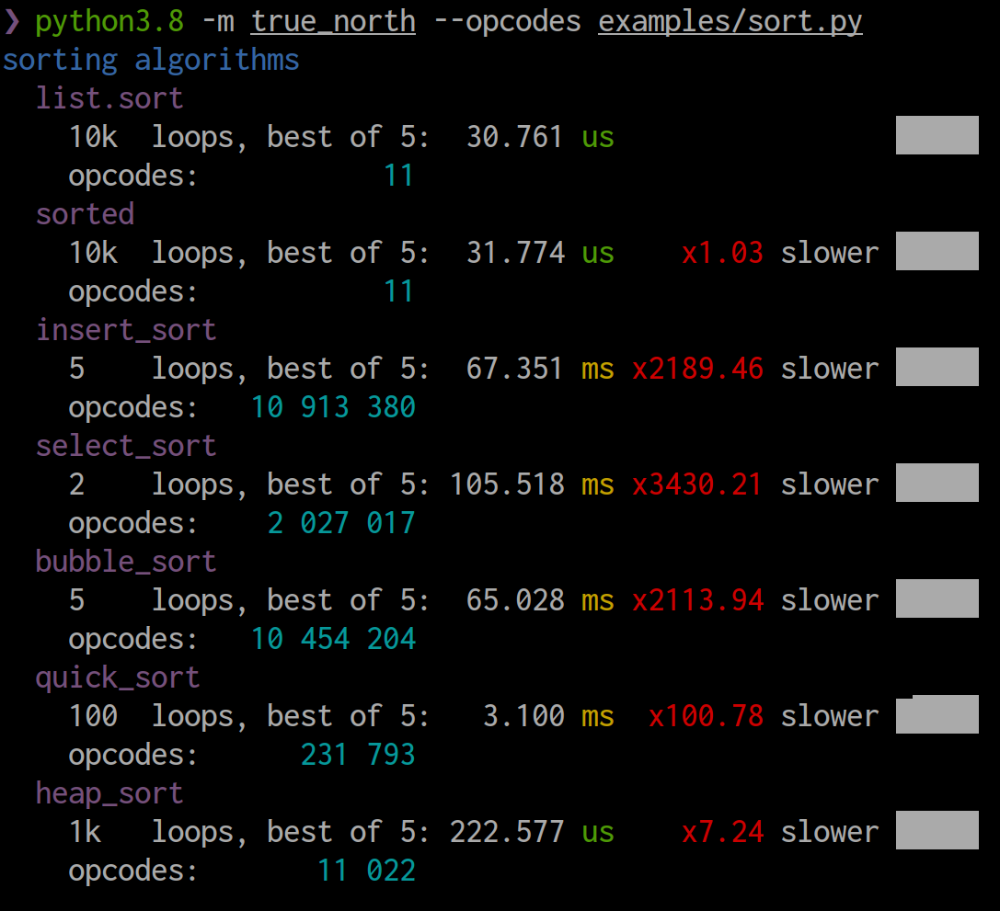

# true-north

Beautiful and pythonic benchmarks engine for Python code.

Features:

+ Follows best practices of benchmarking to produce the most reliable results.
+ Detects caching and side-effects.
+ Opcodes tracing for reproducble benchmarks.
+ 100% type safe.
+ Zero dependency.
+ Highly configurable.
+ Nice and colorful output.
+ Ships with CLI to discover and run all benchmarks.



## Installation

```bash
python3 -m pip install true-north
```

## Usage

```python
import true_north

group = true_north.Group()

@group.add
def math_sorted(r):
    val = [1, 2, 3] * 300
    # timer start before entering the loop
    # and stops when leaving it
    for _ in r:
        sorted(val)

# run and print all benchmarks in the group
if __name__ == '__main__':
    group.print()
```

See [examples](./examples/) for more examples.

## Tracing opcodes

If you run CLI with `--opcodes` or call `Group.print` with `opcodes=True`, the output will also include the number of [opcodes](https://docs.python.org/3/library/dis.html) executed by the benchmark function. The idea is similar to how [benchee](https://github.com/bencheeorg/benchee) [counts reductions](https://github.com/bencheeorg/benchee#measuring-reductions) (function calls) for Erlang code. The difference between measuring execution time and executed opcodes is that the latter is reproducible. There are a few catches, though:

1. Different version of Python produce different number of opcodes. Always run benchmarks on the same Python interpreter.
1. Tracing opcodes requires true-north to register multiple tracing hooks, which slows down the code execution. It won't affect the timing benchmarks, but it will take more time to run the suite.
1. More opcodes doesn't mean slower code. Different opcodes take different time to run. In particular, calling a C function (like `sorted`) is just one opcode. However, if you compare two pure Python functions that don't use call anything heavy, opcodes will roughly correlate with the execution time.



## Reading output

Let's take the following benchmark output as an example:

```plain
sorting algorithms
  <...omitted some results...>
  heap_sort
    1k   loops, best of 5: 240.487 us ±   4.723 us    x5.68 slower █████
          10_022 ops,   23 ns/op
```

+ `sorting algorithms`: the group name.
+ `heap_sort`: the benchmark name. if not specified explicitly, the benchmark finction name will be used.
+ `1k loops`: each time the benchmarking function was called, the loop in it was executed 1000 times. So, if you defined the function as `def heap_sort(r)`, the `r` value is an iterable object with 1000 items. By default, this value is adjusted to finish benchmarking in a reasonable time, but you can specify it explicitly using `loops` argument.
+ `best of 5`: the benchmarking function was called 5 times, and the resulting execution time shown on the right is the best result out of these 5 calls. We do that to minimize how CPU usage by other programs on your machine affects the result. It's 5 by default, but you can change it with `repeats` argument.
+ `240.487 us`: the average execution time of a sinlge loop iteration is about 240 microseconds (ms is 1e−6 of a second).
+ `± 4.723 us`: the standard deviation of each loop iteration is 4.723 microseconds. It is a good value. If it gets close to the average execution time, though, the results aren't reliable. I there was only one loop, the standard deviation will be calculated for all repeats instead.
+ `x5.68 slower`: the average execution time is 5.7 times slower that that of the base benchmark. The base benchmark is the first one in the group. It's always a good idea to have a base benchmark you compare other results to. For example, if you compare your library against other libraries, put the benchmark for your library first to see how you're doing compared to others.
+ `█████`: a histogram where each block represents one repeat (benchmarking function call). The minimum value is 0 and the maximum value is the slowest repeat. If all blocks of the same size, results are good. If you see fluctation in their size, results aren't so reliable, and something affects benchmarks too much. To fix it, you can try to explicitly set a higher value for `loops` argument.
+ `10_022 ops`: a single loop executed 10022 opcodes. Read the section above to learn more about opcodes.
+ `23 ns/op`: execution of each opcode took on average 23 nanoseconds.
